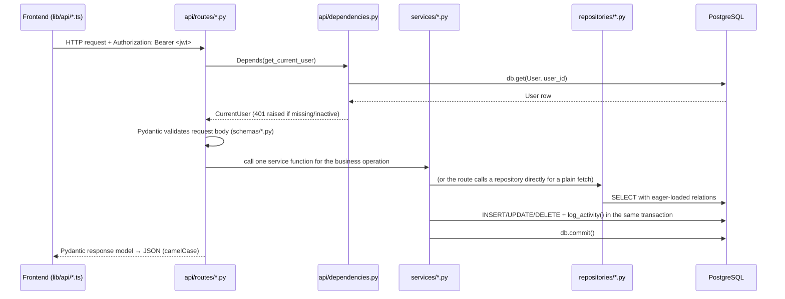

# Backend Architecture

The backend is a single FastAPI application, `backend/app/`. There is one router tree, one
database, and no background workers — every request is handled synchronously start to finish.
Routes, business logic, and data access are split into three layers (routes → services →
repositories/ORM) — see [[AI Coding Conventions]] §4 for the exact boundary between them.

## Package layout

```text
backend/app/
  main.py            FastAPI app, CORS, lifespan seed, /health
  config.py           pydantic-settings Settings
  database.py          SQLAlchemy engine, SessionLocal, get_db()
  security.py           bcrypt hashing, JWT create/decode
  core/
    errors.py            get_or_404() — shared "fetch row or 404" helper
  api/
    __init__.py           exposes `router` (re-exported from router.py)
    router.py             aggregates every domain APIRouter
    dependencies.py        CurrentUser / AdminUser / DbSession
    routes/
      auth.py               /auth/*, /users/*
      employees.py           /employees/*, /documents/*
      hiring.py               /jobs/*, /candidates/*
      projects.py              /projects/*
      payroll.py                /payroll/*
      home.py                     /home
      settings.py                  /settings/*
  models/               one module per domain, __init__.py re-exports every class
  schemas/              one module per domain, __init__.py re-exports every schema
  services/             one module per domain, __init__.py re-exports the public API
  repositories/         one module per domain — only genuinely-repeated eager-loaded queries
```

## File/package responsibilities

| Path | Responsibility |
|---|---|
| `main.py` | Creates the `FastAPI` app, configures CORS, mounts `api.router` at `settings.api_prefix`, runs `seed_defaults()` on startup, exposes `/health` |
| `config.py` | `Settings` (pydantic-settings) — typed env-var configuration, see [[Environment]] |
| `database.py` | SQLAlchemy `engine`, `SessionLocal`, `get_db()` request-scoped session generator |
| `core/errors.py` | `get_or_404(db, Model, id, detail)` — the one shared "fetch by primary key or raise 404" helper, used by every route that needs it |
| `api/dependencies.py` | `CurrentUser` / `AdminUser` — FastAPI `Depends()` chains for auth + RBAC, see [[Backend/Authentication\|Authentication]] |
| `api/routes/*.py` | One `APIRouter()` per domain. A route parses the request, resolves dependencies, calls a service/repository function, and returns a response (via a small `serialize_x()` mapper defined in the same file) — see [[Backend/API\|API]] |
| `api/router.py` | Aggregates every domain router with `include_router()` |
| `models/*.py` | SQLAlchemy ORM models and enums, split by domain — see [[Backend/Models\|Models]] |
| `schemas/*.py` | Pydantic request/response models, split by domain — see [[Backend/API\|API]] |
| `services/*.py` | Business rules: candidate→employee conversion, payroll generation, project assignment, the Home feed, activity logging — see [[Backend/Services\|Services]] |
| `repositories/*.py` | The handful of `select(...)` + `.options(selectinload(...))` query shapes reused across 3+ routes for one entity |
| `security.py` | Password hashing (bcrypt via passlib) and JWT create/decode (PyJWT) |

Routes never contain multi-step business logic, and they never duplicate the same eager-loaded
query 3+ times — that logic lives in `services/` and `repositories/` respectively. See
[[AI Coding Conventions]] for the binding version of this rule.

## App startup (`main.py`)

```python
@asynccontextmanager
async def lifespan(_: FastAPI):
    settings.upload_dir.mkdir(parents=True, exist_ok=True)
    seed_defaults()
    yield
```

`seed_defaults()` runs on **every** startup (not just first-run) and is idempotent:

- Creates the initial admin `User` (`settings.initial_admin_email` /
  `initial_admin_password`) if no user with that email exists yet.
- Seeds four `Department` rows (`Engineering, Design, Quality Assurance, Operations`) if the
  table is empty.
- Seeds four `Designation` rows (`Software Engineer, QA Engineer, Project Manager, Product
  Designer`) if the table is empty.
- Creates the single `CompanyProfile` row (`id=1`) if missing — despite this, nothing reads
  `CompanyProfile` anywhere else in the app; see [[Known Limitations]].

CORS is configured to allow exactly one origin, `settings.frontend_url` (credentials
allowed, all methods/headers) — see [[Environment]].

## Request → response, end to end



Every `DbSession` (`Annotated[Session, Depends(get_db)]`) is opened per-request by
`database.py: get_db()` and closed automatically at the end of the request via the
`with SessionLocal() as session: yield session` context manager.

## Error handling pattern

- `HTTPException(status_code=404, detail="... was not found.")` for a missing row — via
  `core.errors.get_or_404()` for the simple by-id case, or an inline check when the row was
  already fetched through a repository function with extra `.options(...)`.
- `IntegrityError` (unique constraint violations) is caught around `db.commit()`/`db.flush()`
  inside the relevant `services/*.py` function, the transaction is rolled back, and re-raised
  as `HTTPException(409, ...)` with a human-readable message. This pattern repeats in every
  create/update service function that touches a unique column.
- Validation errors (wrong types, missing required fields, out-of-range values) are handled
  automatically by FastAPI/Pydantic and return `422` before the route body ever runs.

## OpenAPI / interactive docs

FastAPI auto-generates docs from the type hints and Pydantic schemas:

- Swagger UI at `/docs`
- ReDoc at `/redoc`
- Raw schema at `/openapi.json`

These reflect `api/routes/*.py`/`schemas/*.py` live — they are the most up-to-date endpoint
reference short of reading the code; [[Backend/API|API]] in this vault mirrors them as static
documentation.

## Related

[[System Architecture]] · [[Backend/API|Backend API]] · [[Backend/Models|Backend Models]] ·
[[Backend/Authentication|Backend Authentication]] · [[Backend/Services|Backend Services]] ·
[[AI Coding Conventions]] · [[Environment]]
