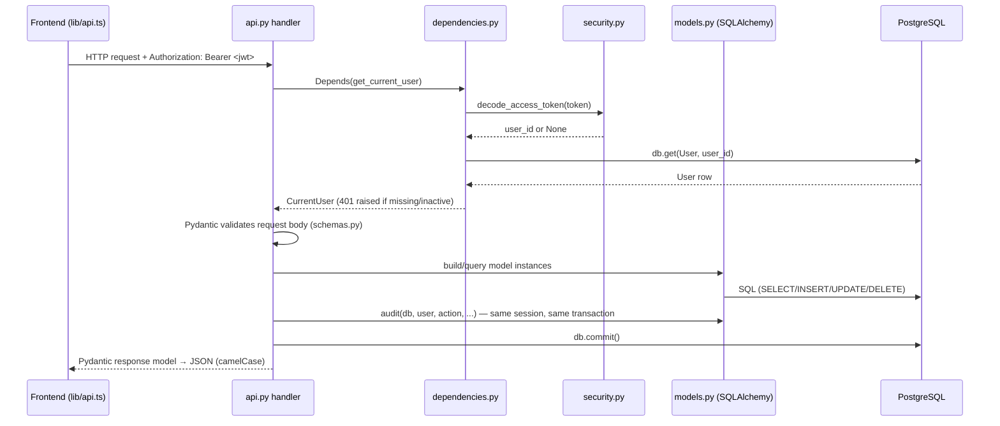

# Backend Architecture

The backend is a single FastAPI application, `backend/app/`. There is one router, one
database, and no background workers — every request is handled synchronously start to finish.

## File responsibilities

| File | Responsibility |
|---|---|
| `main.py` | Creates the `FastAPI` app, configures CORS, mounts the router at `settings.api_prefix`, runs `seed_defaults()` on startup, exposes `/health` |
| `config.py` | `Settings` (pydantic-settings) — typed env-var configuration, see [[Environment]] |
| `database.py` | SQLAlchemy `engine`, `SessionLocal`, `get_db()` request-scoped session generator |
| `dependencies.py` | `CurrentUser` / `AdminUser` — FastAPI `Depends()` chains for auth + RBAC, see [[Backend/Authentication\|Authentication]] |
| `security.py` | Password hashing (bcrypt via passlib) and JWT create/decode (PyJWT) |
| `models.py` | Every SQLAlchemy ORM model and enum — see [[Backend/Models\|Models]] |
| `schemas.py` | Every Pydantic request/response model — see [[Backend/API\|API]] |
| `api.py` | Every endpoint, on one `APIRouter` — see [[Backend/API\|API]] |
| `services.py` | Small shared helpers used by endpoints — see [[Backend/Services\|Services]] |

There are no sub-routers, no service classes, and no repository layer — `api.py` functions
call SQLAlchemy directly and return Pydantic models built by hand or via
`Model.model_validate()`.

## App startup (`main.py`)

```python
@asynccontextmanager
async def lifespan(_: FastAPI):
    settings.upload_dir.mkdir(parents=True, exist_ok=True)
    seed_defaults()
    yield
```

`seed_defaults()` runs on **every** startup (not just first-run) and is idempotent:

- Creates the initial admin `User` (`settings.initial_admin_email` /
  `initial_admin_password`) if no user with that email exists yet.
- Seeds four `Department` rows (`Engineering, Design, Quality Assurance, Operations`) if the
  table is empty.
- Seeds four `Designation` rows (`Software Engineer, QA Engineer, Project Manager, Product
  Designer`) if the table is empty.
- Creates the single `CompanyProfile` row (`id=1`) if missing — despite this, nothing reads
  `CompanyProfile` anywhere else in the app; see [[Known Limitations]].

CORS is configured to allow exactly one origin, `settings.frontend_url` (credentials
allowed, all methods/headers) — see [[Environment]].

## Request → response, end to end



Every `DbSession` (`Annotated[Session, Depends(get_db)]`) is opened per-request by
`database.py: get_db()` and closed automatically at the end of the request via the
`with SessionLocal() as session: yield session` context manager.

## Error handling pattern

- `HTTPException(status_code=404, detail="... was not found.")` for missing rows.
- `IntegrityError` (unique constraint violations) is caught around `db.commit()`/`db.flush()`,
  the transaction is rolled back, and re-raised as `HTTPException(409, ...)` with a
  human-readable message. This pattern repeats in every create/update endpoint that touches a
  unique column (`api.py`).
- Validation errors (wrong types, missing required fields, out-of-range values) are handled
  automatically by FastAPI/Pydantic and return `422` before the handler body ever runs.

## OpenAPI / interactive docs

FastAPI auto-generates docs from the type hints and Pydantic schemas:

- Swagger UI at `/docs`
- ReDoc at `/redoc`
- Raw schema at `/openapi.json`

These reflect `api.py`/`schemas.py` live — they are the most up-to-date endpoint reference
short of reading the code; [[Backend/API|API]] in this vault mirrors them as static
documentation.

## Related

[[System Architecture]] · [[Backend/API|Backend API]] · [[Backend/Models|Backend Models]] ·
[[Backend/Authentication|Backend Authentication]] · [[Backend/Services|Backend Services]] ·
[[Environment]]
