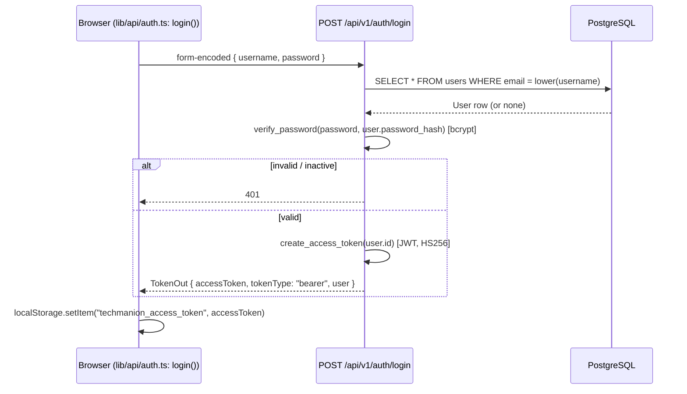

# Authentication & Authorization

Sources: `backend/app/security.py`, `backend/app/api/dependencies.py`, plus the auth endpoints
in `backend/app/api/routes/auth.py`.

## Login flow



- The login endpoint uses FastAPI's `OAuth2PasswordRequestForm` — the request body is
  `application/x-www-form-urlencoded` (`username`/`password`), **not** JSON, unlike every
  other endpoint. `frontend/src/lib/api/auth.ts: login()` builds this specially (it can't go
  through the shared `lib/api/client.ts: api()` helper, which always sends JSON).
- Email lookup is case-insensitive (`form.username.lower()` compared against a
  lowercase-stored `email`).

## Token

```python
def create_access_token(user_id: int) -> str:
    expires = datetime.now(UTC) + timedelta(minutes=settings.access_token_minutes)
    return jwt.encode({"sub": str(user_id), "exp": expires}, settings.jwt_secret, algorithm=settings.jwt_algorithm)
```

- Algorithm: **HS256** (symmetric — `JWT_SECRET` must be kept server-side only).
- Payload: just `sub` (user id, as a string) and `exp`. No role, no scopes embedded — role is
  always re-fetched from the database on every request.
- Lifetime: `ACCESS_TOKEN_MINUTES`, default **480 minutes (8 hours)**. There is no refresh
  token — when it expires, the user must log in again.
- `decode_access_token()` returns `None` on any failure (expired, bad signature, malformed) —
  callers treat `None` the same as "not authenticated".

## Request-time verification

```python
oauth2_scheme = OAuth2PasswordBearer(tokenUrl=f"{settings.api_prefix}/auth/login")

def get_current_user(db: DbSession, token: Annotated[str, Depends(oauth2_scheme)]) -> User:
    user_id = decode_access_token(token)
    user = db.get(User, user_id) if user_id else None
    if not user or not user.is_active:
        raise HTTPException(401, ..., headers={"WWW-Authenticate": "Bearer"})
    return user

CurrentUser = Annotated[User, Depends(get_current_user)]

def require_admin(user: CurrentUser) -> User:
    if user.role != UserRole.ADMIN:
        raise HTTPException(403, "Administrator access is required.")
    return user

AdminUser = Annotated[User, Depends(require_admin)]
```

Every protected endpoint declares `user: CurrentUser` or `user: AdminUser` as a parameter —
FastAPI resolves the dependency chain before the handler body runs, so an unauthenticated or
insufficiently-privileged request never reaches business logic.

## Two-tier RBAC (not four-tier)

`UserRole` has four values — `ADMIN, HR, MANAGER, EMPLOYEE` — but **the API only ever checks
for `ADMIN` vs. not-`ADMIN`.** There is no `require_hr`, `require_manager`, or
role-specific dependency anywhere in the code. Concretely:

| Capability | Enforced by | Who can do it today |
|---|---|---|
| View/edit employees, run payroll, manage candidates/jobs | `CurrentUser` | ADMIN, HR, MANAGER, EMPLOYEE (any active login) |
| Create/edit/delete projects, manage project team | `AdminUser` | ADMIN only |
| Create/manage portal users (`/users`), view audit log, add departments/designations | `AdminUser` | ADMIN only |

So an account created with role `MANAGER` or `EMPLOYEE` from the Team Members page (see
[[Features/Settings|Settings feature]]) behaves **identically to an `HR` account** — the role
value is stored and displayed (`roleLabel()` in the frontend), but it changes no permission
today. This matches the original two-role (Admin/HR) design intent recorded in the legacy
[[decisions]] doc, which the schema anticipates but the product never expanded on. See
[[Known Limitations]].

## Frontend integration

- `frontend/src/lib/api/client.ts: api()` attaches `Authorization: Bearer <token>` to every
  request when a token is present in `localStorage` (key `techmanion_access_token`). Every
  domain module in `lib/api/` (`employees.ts`, `projects.ts`, ...) is a thin wrapper around it.
- A `401` response anywhere clears the stored token (`setToken(null)`) — the next render of
  `AuthProvider` (which re-checks `getToken()`) then redirects to `/login` because `user` stays
  `null`. See [[Frontend/State Management|State Management]].
- `frontend/src/App.tsx: ProtectedLayout` redirects to `/login` if there's no authenticated
  user; `RequireAdmin` (used for `/team` and `/settings`) redirects non-admins to `/home`. This
  is a **UI convenience only** — the real boundary is server-side, as above. See
  [[Frontend/Routing|Frontend Routing]].

## Password storage

`passlib.CryptContext(schemes=["bcrypt"])` — passwords are never stored or logged in plain
text; only the adaptive bcrypt hash (`User.password_hash`) is persisted.

## No self-service, no employee login

There is no signup endpoint and no `Employee`-linked login — see
[[Database/Relationships|Database Relationships]]. Every `User` account is provisioned by an
Admin via `POST /users` (Team Members page).

## Related

[[Backend/API|Backend API]] · [[Backend/Architecture|Backend Architecture]] ·
[[Features/Settings|Settings feature]] · [[Environment]] · [[Known Limitations]] ·
[[AI Coding Conventions]]
