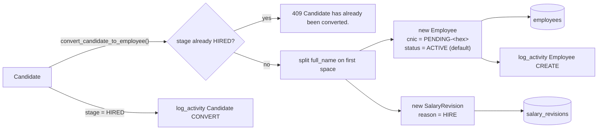
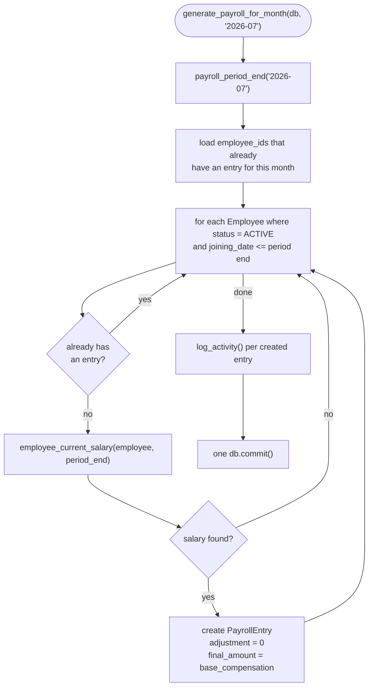

# Backend Services

Source: `backend/app/services/` — one module per domain, re-exported through
`services/__init__.py`. This is where business rules live: multi-step writes, cross-entity
logic, and anything a route shouldn't own directly. See [[AI Coding Conventions]] §4 for the
route/service/repository boundary.

| Module | Functions |
|---|---|
| `activity.py` | `log_activity()` |
| `employees.py` | `employee_current_salary()`, `create_employee()`, `update_employee()`, `add_salary_revision()` |
| `hiring.py` | `convert_candidate_to_employee()` |
| `projects.py` | `assign_employee()`, `remove_assignment()` |
| `payroll.py` | `payroll_period_end()`, `create_payroll_entry()`, `generate_payroll_for_month()`, `update_payroll_entry()`, `delete_payroll_entry()`, `mark_payroll_paid()` |
| `home.py` | `build_home_feed()` |

A service function owns its own `db.commit()`/`db.rollback()` for the operation it implements,
and may raise `HTTPException` directly for an expected business-rule violation (duplicate
email, an already-converted candidate, a bad month format) — that exception **is** the business
rule, so it's fine for it to live here rather than being translated by the route.

## `employee_current_salary(employee, on_date=None) -> SalaryRevision | None`

```python
def employee_current_salary(employee: Employee, on_date: date | None = None) -> SalaryRevision | None:
    target = on_date or date.today()
    eligible = [row for row in employee.salary_revisions if row.effective_date <= target]
    return max(eligible, key=lambda row: row.effective_date) if eligible else None
```

- Operates on an **already-loaded** Python list (`employee.salary_revisions`), not a fresh
  query — callers must `selectinload(Employee.salary_revisions)` first (see
  `repositories/employees.py`).
- "Current" salary = the revision with the latest `effective_date` that is `<=` the target
  date. Future-dated revisions are ignored until their date arrives.
- Returns `None` if the employee has no eligible revision.

**Callers:** `serialize_employee()` (`api/routes/employees.py`), and
`generate_payroll_for_month()` (below), which looks up salary as of the last calendar day of
the target payroll month for each active employee.

Unit-tested in `backend/tests/test_services.py`.

## `create_employee()` / `update_employee()` / `add_salary_revision()`

`services/employees.py`. `create_employee(db, payload, actor)` bundles three things in one
transaction: the `Employee` row, its first `SalaryRevision` (`reason="HIRE"`), and a
`log_activity()` call — `db.flush()` between the insert and the salary revision (to get the
generated employee id), one `db.commit()` at the end, `IntegrityError` → `409` on
email/CNIC collision. `update_employee()` and `add_salary_revision()` follow the same one-commit
shape.

## `convert_candidate_to_employee(db, candidate, payload, actor) -> Employee`

`services/hiring.py` — the single place a `Candidate` becomes an `Employee`:



One DB transaction (`flush` for the generated employee id, then `commit`) — an email collision
with an existing employee rolls back and raises `409`. See [[Database/Hiring|Database Hiring]].

## `assign_employee()` / `remove_assignment()`

`services/projects.py`. `assign_employee(db, project, employee)` inserts the
`ProjectAssignment` row, logs the activity, and commits inside a `try/except IntegrityError`
(duplicate assignment → `409`). `remove_assignment(db, assignment)` reads the employee/project
names off the already-loaded row before deleting it (needed for the activity description),
then deletes and commits.

## Payroll: `payroll_period_end()`, `create_payroll_entry()`, `generate_payroll_for_month()`

`services/payroll.py`. `payroll_period_end(month)` parses a `"YYYY-MM"` string and returns the
**last calendar day of that month** (`calendar.monthrange`), raising `422` on a malformed
string. `generate_payroll_for_month(db, month)`:



- Only `EmployeeStatus.ACTIVE` employees with `joining_date <= period_end` are considered.
- Idempotent per employee: running it again for the same month does **not** duplicate or
  overwrite existing entries.
- Employees with no eligible salary revision are silently skipped (no entry, no error).
- The route (`api/routes/payroll.py: generate_payroll`) re-queries and returns the **full**
  list of entries for that month after calling this, not just the newly created ones.

`create_payroll_entry()`, `update_payroll_entry()`, `delete_payroll_entry()`,
`mark_payroll_paid()` are each a single-entity, single-commit operation with a `log_activity()`
call before commit.

## `build_home_feed(db) -> HomeOut`

`services/home.py` — the Home dashboard's only data source. Queries, in one function:

- Candidates with an upcoming `interview_date` (excluding `HIRED`/`REJECTED`), limit 20.
- Employees with a future `joining_date` and `status = ACTIVE`, limit 20.
- Projects with a future `end_date` and `status != COMPLETED`, limit 20.

These three lists are merged into one `upcoming` list (sorted by date, capped to 12). Anything
in `upcoming` due within 7 days is copied into `needs_attention`, plus a synthetic "N payroll
entries pending" item if `PayrollEntry.status = PENDING` count is nonzero. Separately, the 12
most recent `ActivityLog` rows (filtered to the five entity types the Home page links to) are
returned as `recent_activity`. See [[Features/Home|Features/Home]].

## `log_activity(db, entity, entity_id, action, description) -> None`

`services/activity.py`:

```python
def log_activity(db, entity, entity_id, action, description) -> None:
    db.add(ActivityLog(
        entity=entity, entity_id=str(entity_id), action=action, description=description,
    ))
```

- Adds an `ActivityLog` row to the **same SQLAlchemy session** as the change being recorded —
  it is committed together with the surrounding `db.commit()` in the calling service function,
  so an activity entry and the change it describes are always transactionally consistent.
- No `actor`/`before`/`after` fields — unlike the old `AuditLog` design (see [[Phase 1]]), this
  is a lightweight feed for the Home page's "Recent Activity" panel, not a full audit trail.
  There is no `GET /audit`-style endpoint reading it directly; it's only surfaced through
  `GET /home`.
- Called from `services/*.py` functions, never from a route directly.

### `action` values currently emitted

`CREATE`, `UPDATE`, `DELETE`, `CONVERT` (candidate → employee), `PAID` (payroll marked paid).

### `entity` values currently emitted

`Employee`, `Job`, `Candidate`, `Project`, `PayrollEntry` — these are exactly the five values
`build_home_feed()` filters `GET /home`'s activity feed to, and the five values
`frontend/src/components/organisms/ActivityFeed.tsx: activityHref()` knows how to turn into a
link.

## Related

[[Backend/API|Backend API]] · [[Backend/Models|Backend Models]] ·
[[Backend/Architecture|Backend Architecture]] · [[Database/Payroll|Database Payroll]] ·
[[AI Coding Conventions]]
