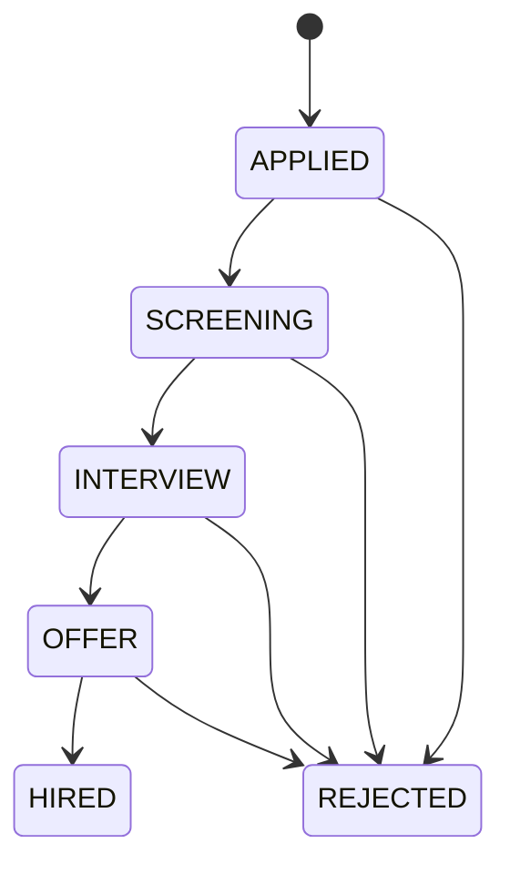
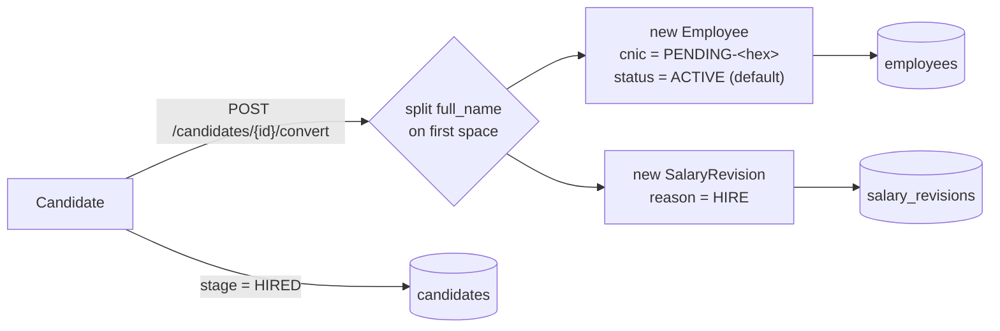

# Database: Hiring

Source: `backend/app/models.py`. Added by migration `20260730_02_hiring`. Two tables: `jobs`
and `candidates`.

## `Job`

| Column | Notes |
|---|---|
| `title` | `String(160)` |
| `description` | `Text` |
| `status` | `JobStatus` enum: `OPEN \| CLOSED`, default `OPEN` |

`candidates` relationship: `cascade="all, delete-orphan"` — deleting a job deletes all of its
candidates (enforced both by the ORM relationship and `ondelete="CASCADE"` on the FK).

## `Candidate`

| Column | Notes |
|---|---|
| `full_name` | `String(160)` |
| `email` | `String(320)`, indexed, **not unique** (a person can apply to multiple jobs) |
| `phone` | nullable |
| `job_id` | FK → `jobs.id`, `ondelete="CASCADE"` |
| `stage` | `CandidateStage` enum, default `APPLIED` |
| `resume` | `String(500)`, nullable — a free-text link, not a file upload |
| `interview_date` | `Date`, nullable |
| `notes` | `Text`, nullable |

## `CandidateStage` pipeline

The enum permits any-to-any transitions in the database (the frontend's stage `<Select>`
offers all six values regardless of current stage) — there is no server-side state-machine
enforcement. `HIRED` is additionally set automatically as a side effect of the convert action
below, never chosen directly by a recruiter in the normal flow (though nothing stops it).

## Candidate → Employee conversion

`POST /candidates/{id}/convert` (`backend/app/api.py`) is the only place a `Candidate` becomes
an `Employee`:

Request payload (`ConvertToEmployeePayload`): `employeeType`, `joiningDate`, `designationId?`,
`baseAmount`, `currency`. The candidate's `email`/`phone`/name seed the new `Employee`; a
`cnic` is not collected here and is placeholder-generated the same way as a manual employee
create. The whole operation is one DB transaction — if the email collides with an existing
employee's unique `email`, it rolls back with `409`.

This is a **one-way, one-time** action — there is no link back from `Employee` to `Candidate`
after conversion (no FK either direction). See [[Database/Relationships|Relationships]].

## Related

[[Database/Schema|Database Schema]] · [[Database/Employees|Database Employees]] ·
[[Features/Hiring|Hiring feature]] · [[Backend/API|Backend API]]
