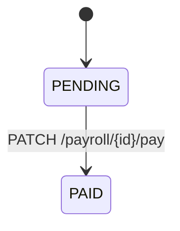
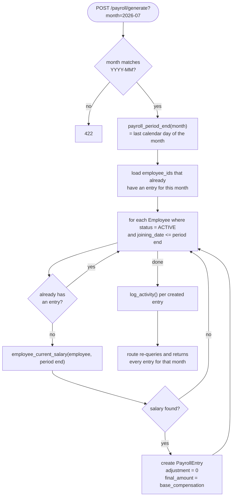

# Database: Payroll

Source: `backend/app/models/payroll.py`. This is a **complete redesign**, not an evolution, of the
original payroll model — the old `PayrollRun` → `Payslip` → `PayslipLineItem` chain plus
`TaxSlab` were all dropped by migration `20260730_03_simplify_projects_payroll` and replaced
with a single flat table. See [[Phase 1]] for the rationale and the legacy
[[data-model]] doc for the original three-table + tax-engine design.

## `PayrollEntry`

One row = one employee's pay for one month. Table `payroll_entries`.

| Column | Type | Notes |
|---|---|---|
| `employee_id` | FK → `employees.id` | |
| `month` | `String(7)`, indexed | `"YYYY-MM"` format, validated in the endpoint (not a DB constraint) |
| `base_compensation` | `BigInteger` | minor units |
| `adjustment` | `BigInteger`, default `0` | minor units; **negative = deduction** |
| `final_amount` | `BigInteger` | **stored, not computed at read time** — see rule below |
| `currency` | `String(3)`, default `PKR` | |
| `status` | `PayrollEntryStatus` enum | `PENDING \| PAID`, default `PENDING` |
| `payment_date` | `Date`, nullable | set when marked paid |
| `notes` | `Text`, nullable | |

`UniqueConstraint("employee_id", "month")` — **one payroll entry per employee per month**,
enforced at the database level (`409` on the API when violated).

## The core business rule

> **`final_amount = base_compensation + adjustment`**

Computed in Python in `backend/app/services/payroll.py` at both create and update time
(`entry.final_amount = payload.base_compensation + payload.adjustment`) and written to the
column — it is **not** a generated/computed SQL column, so it only stays correct because every
write path recomputes it. A negative `adjustment` value is how a deduction is represented;
there is no separate deduction/earning type distinction (unlike the old `PayslipLineItem`
model).

## Status lifecycle

One-directional — there is no "unmark paid" endpoint. `payment_date` defaults to today
(`date.today()`) if the `PATCH .../pay` request doesn't supply one.

## Generate flow

`POST /payroll/generate?month=YYYY-MM` (`api/routes/payroll.py: generate_payroll`, business
logic in `services/payroll.py: generate_payroll_for_month()`):

Key points:
- Only `EmployeeStatus.ACTIVE` employees whose `joining_date` is on or before the month's last
  day are considered (`ON_LEAVE`/`RESIGNED`/`TERMINATED` are skipped) — see
  [[Database/Employees|Employees]].
- Idempotent per employee: running it again for the same month does **not** duplicate or
  overwrite existing entries for employees that already have one.
- Uses whatever `SalaryRevision` is effective as of the **last calendar day** of the target
  month (see `employee_current_salary()` in [[Backend/Services|Services]]).
- Employees with no salary revision at all are silently skipped (no entry, no error).
- The route always returns the **full** list of entries for that month, not just newly created
  ones.

## Related

[[Database/Schema|Database Schema]] · [[Database/Employees|Database Employees]] ·
[[Features/Payroll|Payroll feature]] · [[Backend/API|Backend API]] · [[Phase 1]] ·
[[Known Limitations]]
