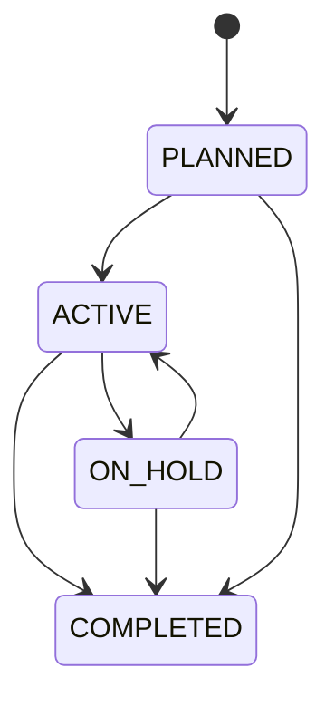

# Database: Projects

Source: `backend/app/models/projects.py`. Simplified by migration
`20260730_03_simplify_projects_payroll` — see [[Phase 1]] for what was removed and why.

## `Project`

| Column | Type | Notes |
|---|---|---|
| `name` | `String(160)`, unique | |
| `client_name` | `String(160)` | free text — there is no `Client` entity |
| `status` | `ProjectStatus` enum | `PLANNED \| ACTIVE \| ON_HOLD \| COMPLETED`, default `PLANNED` |
| `start_date` | `Date` | required |
| `end_date` | `Date`, nullable | "target end date" in the UI |
| `notes` | `Text`, nullable | |

`assignments` relationship: `cascade="all, delete-orphan"` — deleting a project deletes its
team assignments.

### Fields that existed before the Phase 1 simplification (now removed)

`contract_value`, `currency`, `trello_url` were dropped from `Project`. See
[[Phase 1]] and the legacy [[data-model]] doc for the original design.

## `ProjectAssignment`

Pure join table between `Project` and `Employee` — table `project_assignments`.

| Column | Notes |
|---|---|
| `project_id` | FK → `projects.id`, `ondelete="CASCADE"` |
| `employee_id` | FK → `employees.id` |

`UniqueConstraint("project_id", "employee_id")` — an employee can only be assigned to the same
project once (`409` on duplicate assignment).

### Fields that existed before the Phase 1 simplification (now removed)

`project_role` (free text), `allocation_pct` (0–100), and per-assignment `start_date`/
`end_date` were dropped. Today an assignment is just "this employee is on this project" — no
role, no allocation percentage, no assignment-level dates.

## Status lifecycle

Not state-machine-enforced — `PUT /projects/{id}` accepts any `ProjectStatus` value
unconditionally.

## Related

[[Database/Schema|Database Schema]] · [[Database/Relationships|Relationships]] ·
[[Features/Projects|Projects feature]] · [[Backend/API|Backend API]] · [[Phase 1]]
