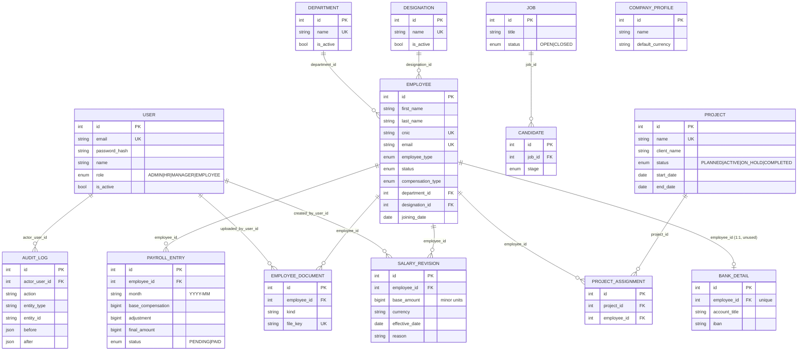

# Database Schema

All tables are defined as SQLAlchemy models in `backend/app/models.py` and created/altered by
Alembic migrations in `backend/alembic/versions/`. Database: **PostgreSQL**.

Every table (except `audit_logs`) mixes in `TimestampMixin` → `created_at`, `updated_at`
(timezone-aware, server-set in Python via `utc_now()`).

## Entity-relationship diagram

`PROJECT_ASSIGNMENT` and `PAYROLL_ENTRY` each have a composite `UniqueConstraint` — see
[[Database/Relationships|Relationships]].

## Tables at a glance

| Table | Model | Purpose | Doc |
|---|---|---|---|
| `users` | `User` | Portal login accounts | [[Backend/Authentication\|Authentication]] |
| `departments` | `Department` | Configurable department list | [[Database/Employees\|Employees]] |
| `designations` | `Designation` | Configurable job-title list | [[Database/Employees\|Employees]] |
| `jobs` | `Job` | Open roles | [[Database/Hiring\|Hiring]] |
| `candidates` | `Candidate` | Applicants against a job | [[Database/Hiring\|Hiring]] |
| `employees` | `Employee` | Employee record | [[Database/Employees\|Employees]] |
| `salary_revisions` | `SalaryRevision` | Effective-dated salary history | [[Database/Employees\|Employees]] |
| `bank_details` | `BankDetail` | Bank account per employee — **modeled, no API** | [[Known Limitations]] |
| `employee_documents` | `EmployeeDocument` | Uploaded file metadata | [[Database/Employees\|Employees]] |
| `projects` | `Project` | Client project | [[Database/Projects\|Projects]] |
| `project_assignments` | `ProjectAssignment` | Employee ⇄ project join | [[Database/Projects\|Projects]] |
| `payroll_entries` | `PayrollEntry` | One payroll line per employee per month | [[Database/Payroll\|Payroll]] |
| `company_profiles` | `CompanyProfile` | Single-row company info — **modeled, no API** | [[Known Limitations]] |
| `audit_logs` | `AuditLog` | Append-only action log | [[Backend/Services\|Services]] |

## Enums

Defined as `str, Enum` classes in `models.py`, stored as native Postgres `ENUM` types via
SQLAlchemy's `Enum(...)`.

| Enum | Values | Used by |
|---|---|---|
| `UserRole` | `ADMIN, HR, MANAGER, EMPLOYEE` | `User.role` |
| `EmployeeType` | `FULL_TIME, PART_TIME, CONTRACT` | `Employee.employee_type` |
| `EmployeeStatus` | `ACTIVE, ON_LEAVE, RESIGNED, TERMINATED` | `Employee.status` |
| `CompensationType` | `FIXED, HOURLY, PROJECT` | `Employee.compensation_type` (only `FIXED` is functionally used — see [[Known Limitations]]) |
| `ProjectStatus` | `PLANNED, ACTIVE, ON_HOLD, COMPLETED` | `Project.status` |
| `PayrollEntryStatus` | `PENDING, PAID` | `PayrollEntry.status` |
| `JobStatus` | `OPEN, CLOSED` | `Job.status` |
| `CandidateStage` | `APPLIED, SCREENING, INTERVIEW, OFFER, HIRED, REJECTED` | `Candidate.stage` |

## Money convention

Every monetary column (`base_amount`, `base_compensation`, `adjustment`, `final_amount`) is a
`BigInteger` storing **minor currency units** (e.g. paisa, not rupees), paired with a
3-letter `currency` string column (default `"PKR"`). The frontend divides/multiplies by 100 at
the UI boundary — see `frontend/src/lib/format.ts: formatMoney()` and
[[Frontend/State Management|State Management]]. There is no floating-point money anywhere in
the schema.

## Migration history

| Migration | Effect |
|---|---|
| `20260725_01_initial` | Base schema via `Base.metadata.create_all` |
| `20260730_02_hiring` | Adds `jobs`, `candidates` |
| `20260730_03_simplify_projects_payroll` | Drops legacy `payroll_runs`/`payslips`/`payslip_line_items`/`tax_slabs` tables and their enum types, trims `projects`/`project_assignments` columns, creates `payroll_entries` | 

See [[Phase 1]] for why the third migration exists (a deliberate simplification of the
original payroll/project design).

## Related

[[Database/Relationships|Relationships]] · [[Database/Employees|Employees]] ·
[[Database/Hiring|Hiring]] · [[Database/Projects|Projects]] · [[Database/Payroll|Payroll]] ·
[[Backend/Models|Backend Models]]
