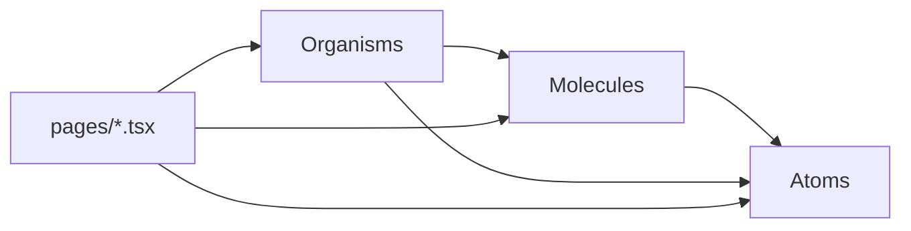

# Frontend Components

Source: `frontend/src/components/{atoms,molecules,organisms}/`, following **atomic design**.
Each tier re-exports through an `index.ts` barrel; `components/index.ts` re-exports all three
tiers, but most pages import from the tier-specific barrel (`../components/atoms`,
`../components/molecules`, `../components/organisms`).

## Atoms (`components/atoms/`)

Smallest, style-only building blocks — no data fetching, minimal internal state.

| Component | File | Notes |
|---|---|---|
| `Avatar` | `Avatar.tsx` | Shows an image if `src` given, else a colored circle with `initials(alt)` |
| `StatusChip` | `Badge.tsx` | Generic enum-value pill; color keyed by matching against known status strings (`ACTIVE/PAID/COMPLETED` → primary tone, `TERMINATED/CANCELLED` → error tone, etc.) — see note below |
| `Button` | `Button.tsx` | Variants `primary\|secondary\|ghost\|danger`, sizes `sm\|md\|lg` |
| `Checkbox` | `Checkbox.tsx` | Styled `<input type="checkbox">` — used decoratively in `EmployeeTable` (no select-all logic wired) |
| `Divider` | `Divider.tsx` | Horizontal/vertical rule |
| `Icon` | `Icon.tsx` | Wraps a Material Symbols ligature name in a `` |
| `IconButton` | `IconButton.tsx` | Icon-only button, variants `ghost\|filled\|tonal` |
| `Input`, `Select`, `Textarea` | respective files | Styled native form controls |
| `Loading` | `Loading.tsx` | Spinner |
| `Logo` | `Logo.tsx` | Wordmark, `compact` prop for mobile header |
| `PageTitle`, `SectionHeading`, `Eyebrow` | `Typography.tsx` | Text styles |

> [!note] `StatusChip` outlives the enums it was written for
> Its color logic still checks for `"CANCELLED"` and `"IN_PROGRESS"`, values that existed on
> the **old** `ProjectStatus`/`PaymentStatus` enums before the Phase 1 simplification (see
> [[Phase 1]]). No current enum produces those strings, so those branches are dead but
> harmless — every current status value falls through to the default (gray) tone unless it
> matches `ACTIVE/PAID/COMPLETED` or `TERMINATED`.

## Molecules (`components/molecules/`)

Small compositions of atoms with a bit of local behavior.

| Component | File | Purpose |
|---|---|---|
| `EmployeeCell` | `EmployeeCell.tsx` | Avatar + name + subtitle, used in every table's first column |
| `EmptyState` | `EmptyState.tsx` | Centered placeholder message for empty lists |
| `FilterSelect` | `FilterSelect.tsx` | Pill-styled `<select>` for table filter bars |
| `FormField` | `FormField.tsx` | Label + hint wrapper around a form control |
| `PageHeaderActions` | `PageHeaderActions.tsx` | Flex row for header action buttons |
| `PaginationControls` | `PaginationControls.tsx` | Page-number UI — **not wired to real server pagination anywhere**, see [[Known Limitations]] |
| `SearchInput` | `SearchInput.tsx` | Search box with a clear button |
| `TableActionMenu` | `TableActionMenu.tsx` | "More actions" `⋮` icon button |
| `UserMenu` | `UserMenu.tsx` | Header avatar dropdown: profile/team links, theme toggle, sign out |

## Organisms (`components/organisms/`)

Page-section-sized components.

| Component | File | Purpose |
|---|---|---|
| `AppShell` | `AppShell.tsx` | Authenticated layout: header + sidebar + `<Outlet/>`; owns mobile sidebar open/close state |
| `AppHeader` | `AppHeader.tsx` | Top bar: logo, current section label (derived from `lib/nav.ts` + current path), `UserMenu` |
| `Sidebar` | `Sidebar.tsx` | Nav links from `NAV_ITEMS`/`ADMIN_NAV_ITEMS`, mobile overlay + Escape-to-close |
| `DataTable` (+ `TableHeadRow`, `TableRow`) | `DataTable.tsx` | Generic scrollable `<table>` shell used by every list page |
| `EmployeeTable` | `EmployeeTable.tsx` | Employee-specific table body (checkbox, cell, status) built on `DataTable` |
| `FilterToolbar` | `FilterToolbar.tsx` | Flex wrapper for a row of `SearchInput`/`FilterSelect` |
| `PageHeader` | `PageHeader.tsx` | Title + description + meta badge + actions row, used at the top of every page |
| `PayrollSummary` | `PayrollSummary.tsx` | Stat row + paid/pending progress bar for the Payroll page |
| `ProfileHeader` | `ProfileHeader.tsx` | Employee detail page's hero header (avatar, name, status, quick facts, Edit link) |

## Related

[[Frontend/Pages|Frontend Pages]] · [[Frontend/UI Architecture|Frontend UI Architecture]] ·
[[Frontend/State Management|Frontend State Management]]
