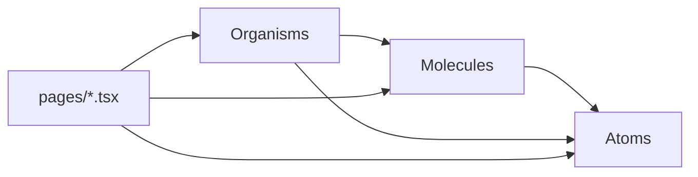

# Frontend Components

Source: `frontend/src/components/{atoms,molecules,organisms}/`, following **atomic design**.
Each tier re-exports through an `index.ts` barrel; `components/index.ts` re-exports all three
tiers, but most pages import from the tier-specific barrel (`../components/atoms`,
`../components/molecules`, `../components/organisms`). See [[AI Coding Conventions]] §2 for the
binding rules on what belongs in each tier, and search these tables before adding a new
component — reuse an existing one (or extend it with a prop) first.

## Atoms (`components/atoms/`)

Smallest, style-only building blocks — no data fetching, no domain knowledge, minimal internal
state.

| Component | File | Notes |
|---|---|---|
| `Avatar` | `Avatar.tsx` | Shows an image if `src` given, else a colored circle with `initials(alt)` |
| `StatusChip` | `Badge.tsx` | Generic enum-value pill; color keyed by matching against known status strings (`ACTIVE/PAID/COMPLETED` → primary tone, `TERMINATED/CANCELLED` → error tone, `PARTIALLY_PAID/IN_PROGRESS` → tertiary tone, else gray) — see note below |
| `Button` | `Button.tsx` | Variants `primary\|secondary\|ghost\|danger`, sizes `sm\|md\|lg` |
| `Icon` | `Icon.tsx` | Wraps a Material Symbols ligature name in a `` |
| `IconButton` | `IconButton.tsx` | Icon-only button, variants `ghost\|filled\|tonal` |
| `Input`, `Select`, `Textarea` | respective files | Styled native form controls |
| `Loading` | `Loading.tsx` | Spinner |
| `Logo` | `Logo.tsx` | Wordmark, `compact` prop for mobile header |
| `PageTitle`, `SectionHeading`, `Eyebrow` | `Typography.tsx` | Text styles |

> [!note] `StatusChip` still checks for retired enum values
> Its color logic checks for `"CANCELLED"` and `"IN_PROGRESS"`, values that existed on the
> **old** `ProjectStatus`/`PaymentStatus` enums before the Phase 1 simplification (see
> [[Phase 1]]). No current enum produces those strings, so those branches are dead but
> harmless — every current status value falls through to the default (gray) tone unless it
> matches one of the tone groups above.

`Checkbox` and `Divider` atoms existed in an earlier version of the design system but were
removed as unused — see [[Decisions/Known Limitations|Known Limitations]] if you're looking for
them in git history.

## Molecules (`components/molecules/`)

Small compositions of atoms with a bit of local behavior.

| Component | File | Purpose |
|---|---|---|
| `EmployeeAssignSelect` | `EmployeeAssignSelect.tsx` | A `<select>` for assigning an employee to something; reused by the Projects list row and the Project Detail team panel (`resetAfterSelect` prop matches each site's original reset behavior) |
| `EmployeeCell` | `EmployeeCell.tsx` | Avatar + name + subtitle, used in every table's first column |
| `EmptyState` | `EmptyState.tsx` | Centered placeholder message for empty lists |
| `FilterSelect` | `FilterSelect.tsx` | Pill-styled `<select>` for table filter bars |
| `FormField` | `FormField.tsx` | Label + hint wrapper around a form control |
| `MoneyInput` | `MoneyInput.tsx` | Wraps `Input` for a minor-unit currency amount — displays `value / 100`, calls `onChange` with `Math.round(value * 100)` |
| `PageHeaderActions` | `PageHeaderActions.tsx` | Flex row for header action buttons |
| `SearchInput` | `SearchInput.tsx` | Search box with a clear button |
| `TableActionMenu` | `TableActionMenu.tsx` | "More actions" `⋮` icon button |
| `UserMenu` | `UserMenu.tsx` | Header avatar dropdown: profile/team links, theme toggle, sign out |

`PaginationControls` existed in an earlier version but was removed as decorative/unused — see
[[Decisions/Known Limitations|Known Limitations]].

## Organisms (`components/organisms/`)

Page-section-sized components. A `*Table` organism receives already-fetched/already-filtered
rows as a prop plus row-action callbacks — it does not fetch or filter data itself
(loading/empty-state handling stays in the page). A `*FormPanel` organism is an inline
`surface-panel` form (this app has no modal/dialog component — see [[AI Coding Conventions]]
§13) toggled by page state, taking `form`/`onChange`/`onSubmit`/`onCancel` props.

### Layout shell

| Component | File | Purpose |
|---|---|---|
| `AppShell` | `AppShell.tsx` | Authenticated layout: header + sidebar + `<Outlet/>`; owns mobile sidebar open/close state |
| `AppHeader` | `AppHeader.tsx` | Top bar: logo, current section label (derived from `lib/nav.ts` + current path), `UserMenu` |
| `Sidebar` | `Sidebar.tsx` | Nav links from `NAV_ITEMS`/`ADMIN_NAV_ITEMS`, mobile overlay + Escape-to-close |
| `DataTable` (+ `TableHeadRow`, `TableRow`) | `DataTable.tsx` | Generic scrollable `<table>` shell used by every list page |
| `FilterToolbar` | `FilterToolbar.tsx` | Flex wrapper for a row of `SearchInput`/`FilterSelect` |
| `PageHeader` | `PageHeader.tsx` | Title + description + meta badge + actions row, used at the top of every page |

### Employees

| Component | File | Purpose |
|---|---|---|
| `EmployeeTable` | `EmployeeTable.tsx` | Employee directory table body built on `DataTable` |
| `ProfileHeader` | `ProfileHeader.tsx` | Employee detail page's hero header (avatar, name, status, quick facts, Edit link) |
| `EmployeeOverviewPanel` | `EmployeeOverviewPanel.tsx` | Read-only Overview tab (name/email/phone/job title/type/status/joining date) |
| `CompensationPanel` | `CompensationPanel.tsx` | Current-salary display + "Add Revision" form (`MoneyInput`-based) |
| `DocumentsPanel` | `DocumentsPanel.tsx` | Uploaded-document list + upload form |

### Hiring

| Component | File | Purpose |
|---|---|---|
| `JobsTable` | `JobsTable.tsx` | Jobs list table body |
| `JobFormPanel` | `JobFormPanel.tsx` | Create/edit job inline form |
| `CandidatesTable` | `CandidatesTable.tsx` | Candidates list table body (convert/edit/delete actions) |
| `CandidateFormPanel` | `CandidateFormPanel.tsx` | Create/edit candidate inline form |
| `ConvertCandidateFormPanel` | `ConvertCandidateFormPanel.tsx` | Candidate → Employee conversion form |

### Projects

| Component | File | Purpose |
|---|---|---|
| `ProjectsTable` | `ProjectsTable.tsx` | Projects list table body (avatar stack, inline assign dropdown) |
| `ProjectFormPanel` | `ProjectFormPanel.tsx` | Create (Projects list) and edit (Project Detail) form — shared component, layout classes passed via `className`/`fullWidthClassName` props so each call site keeps its original grid/spacing |
| `ProjectInfoPanel` | `ProjectInfoPanel.tsx` | Read-only project info (Project Detail, non-editing view) |
| `ProjectTeamPanel` | `ProjectTeamPanel.tsx` | Team member list + assign/remove (Project Detail) |

### Payroll

| Component | File | Purpose |
|---|---|---|
| `PayrollTable` | `PayrollTable.tsx` | Payroll entries table body (mark-paid/edit/delete actions) |
| `PayrollEntryFormPanel` | `PayrollEntryFormPanel.tsx` | Create/edit payroll entry inline form |
| `PayrollSummary` | `PayrollSummary.tsx` | Stat row + paid/pending progress bar |

### Home

| Component | File | Purpose |
|---|---|---|
| `QuickActionsPanel` | `QuickActionsPanel.tsx` | The four quick-action links (Add Candidate/Employee/Project, Open Payroll) |
| `UpcomingItemsPanel` | `UpcomingItemsPanel.tsx` | Generic "titled panel of dated items" — used for both Needs Attention and Upcoming |
| `ActivityFeed` | `ActivityFeed.tsx` | Recent-activity list, links each row to its entity where applicable |

## Related

[[Frontend/Pages|Frontend Pages]] · [[Frontend/UI Architecture|Frontend UI Architecture]] ·
[[Frontend/State Management|Frontend State Management]] · [[AI Coding Conventions]]
