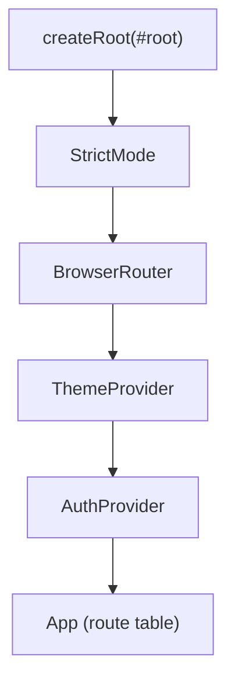

# Frontend Routing

Source: `frontend/src/App.tsx`, using **React Router v7** (`react-router-dom`). One route
table, two guard components.

## Provider nesting (`main.tsx`)



`ThemeProvider` wraps `AuthProvider` so theme state is available even on the (unauthenticated)
login page. See [[Frontend/State Management|State Management]].

## Route table

| Path | Component | Guard |
|---|---|---|
| `/login` | `LoginPage` | redirects to `/home` if already logged in |
| `/` | — | `<Navigate to="/home" replace />` |
| `/home` | `HomePage` | `ProtectedLayout` |
| `/hiring` | `HiringPage` | `ProtectedLayout` |
| `/employees` | `EmployeesPage` | `ProtectedLayout` |
| `/employees/new` | `EmployeeFormPage` (create mode) | `ProtectedLayout` |
| `/employees/:employeeId` | `EmployeeDetailPage` | `ProtectedLayout` |
| `/employees/:employeeId/edit` | `EmployeeFormPage` (edit mode) | `ProtectedLayout` |
| `/projects` | `ProjectsPage` | `ProtectedLayout` |
| `/projects/:projectId` | `ProjectDetailPage` | `ProtectedLayout` |
| `/payroll` | `PayrollPage` | `ProtectedLayout` |
| `/profile` | `ProfilePage` | `ProtectedLayout` |
| `/team` | `TeamPage` | `ProtectedLayout` + `RequireAdmin` |
| `/settings` | `SettingsPage` | `ProtectedLayout` + `RequireAdmin` |
| `*` (anything else) | — | `<Navigate to="/home" replace />` |

`EmployeeFormPage` is a single component used for both create and edit — it checks whether
`useParams().employeeId` is present to decide mode (see [[Frontend/Pages|Frontend Pages]]).

## Guard components

```tsx
function ProtectedLayout() {
  const { user, loading } = useAuth();
  if (loading) return <Loading />;
  return user ? <AppShell /> : <Navigate to="/login" replace />;
}

function RequireAdmin({ children }) {
  const { user } = useAuth();
  return user?.role === "ADMIN" ? <>{children}</> : <Navigate to="/home" replace />;
}
```

- `ProtectedLayout` is the parent `<Route element={...}>` for every authenticated route — it
  renders `AppShell` (header + sidebar + `<Outlet/>`) only once a user is resolved, otherwise
  redirects to `/login`.
- `RequireAdmin` wraps `/team` and `/settings` individually. **This is a client-side
  convenience only** — the actual authorization boundary is server-side (`AdminUser`
  dependency), see [[Backend/Authentication|Backend Authentication]]. A non-admin who
  navigates to `/team` directly is bounced to `/home` before any admin-only API call is even
  attempted, but the API would reject those calls anyway.

## Navigation configuration

`frontend/src/lib/nav.ts` drives the sidebar (`Sidebar.tsx`) and the header's current-section
label (`AppHeader.tsx`):

```ts
NAV_ITEMS = [Home, Hiring, Employees, Projects, Payroll]  // everyone
ADMIN_NAV_ITEMS = [Team Members, Organization]            // ADMIN only, shown after a divider
```

`Organization` points to `/settings` (departments/designations) and `Team Members` to `/team`
— two distinct admin-only routes. See [[Features/Settings|Settings feature]].

## Related

[[Frontend/Pages|Frontend Pages]] · [[Frontend/State Management|Frontend State Management]] ·
[[Backend/Authentication|Backend Authentication]] · [[Frontend/UI Architecture|Frontend UI Architecture]] ·
[[AI Coding Conventions]]
