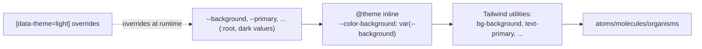
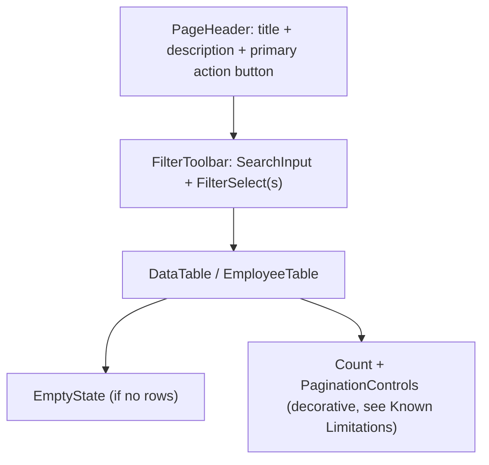

# Frontend UI Architecture

## Atomic design

`frontend/src/components/` is organized as **atoms → molecules → organisms**, consumed by
`pages/`. See [[Frontend/Components|Components]] for the full inventory. There is no separate
"templates" tier — page layout is written directly in each `pages/*.tsx` file, composed from
organisms/molecules/atoms.

## Styling: Tailwind CSS v4 + design-token CSS variables

`frontend/src/styles.css` is the single stylesheet (`@import "tailwindcss"` — no
`tailwind.config.js`; Tailwind v4 configures itself via CSS). Two layers:

1. **Plain CSS custom properties** on `:root` and `:root[data-theme="light"]` — a
   Material-Design-3-flavored palette (`--background`, `--surface`, `--on-surface`,
   `--primary`, `--outline-variant`, etc.). Dark values are the `:root` default; light values
   override under the `[data-theme="light"]` attribute selector.
2. **`@theme inline { ... }`** maps Tailwind's generated color utilities
   (`bg-surface`, `text-on-surface-variant`, …) onto those same `var(--x)` references —
   done this way (rather than putting literal colors inside `@theme`) specifically so the
   `data-theme` runtime override survives Tailwind's production build/purge (see the comment
   at the top of `styles.css`).

Components then just use ordinary Tailwind utility classes (`bg-surface-container-high`,
`text-on-surface-variant`) — no CSS Modules, no styled-components, no inline `style` objects
except for a few dynamic widths (progress bars in `PayrollSummary`).

## Theming

- Two themes: `dark` (default) and `light`, switched by setting `data-theme` on
  `<html>`. See [[Frontend/State Management|State Management]] for `ThemeContext`.
- `index.html` sets `data-theme` via an inline `<script>` **before** the React bundle loads
  (reading `localStorage["theme"]`, defaulting to `dark`) to avoid a flash of unstyled/wrong
  theme.
- Note the legacy [[planning-doc]] originally said *"Dark mode: Not planned"* for v1 — the
  shipped product went the opposite direction and defaults to dark with light as the optional
  theme. See [[Phase 1]].

## Icons and fonts

- `Icon` atom renders **Material Symbols Outlined** ligature names inside a `` (e.g. `<Icon>add</Icon>` renders a "+" glyph). The font
  is loaded from Google Fonts in `index.html`. `lucide-react` is a listed dependency but is not
  actually imported/used anywhere in the current pages/components — the running app's icon
  system is entirely the Material Symbols font.
- Typefaces: `Google Sans` (headings/UI) and `Roboto`, both loaded via `<link>` in
  `index.html`.

## Layout shell

`AppShell` → `AppHeader` (fixed top, `h-16`) + `Sidebar` (fixed left, `w-60`, collapses to an
overlay drawer below the `lg` breakpoint) + `<main class="pt-16 lg:pl-60"><Outlet/></main>`.
Every page then renders its own `mx-auto max-w-[...]px px-6 py-7` content wrapper — page widths
vary slightly per page (`max-w-[1450px]` for directories/lists, `max-w-3xl`/`max-w-4xl` for
forms/detail views).

## Common page anatomy

Every list page (`employees`, `projects`, `payroll`, `hiring`) follows the same shape:

## Responsiveness

Tailwind responsive prefixes (`md:`, `lg:`, `xl:`) are used throughout for grid columns and
table min-widths; wide tables (`DataTable`) scroll horizontally on small screens via
`overflow-x-auto` rather than reflowing to cards.

## Related

[[Frontend/Components|Frontend Components]] · [[Frontend/Pages|Frontend Pages]] ·
[[Frontend/State Management|Frontend State Management]] · [[Tech Stack]]
