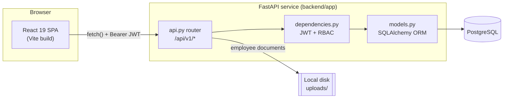
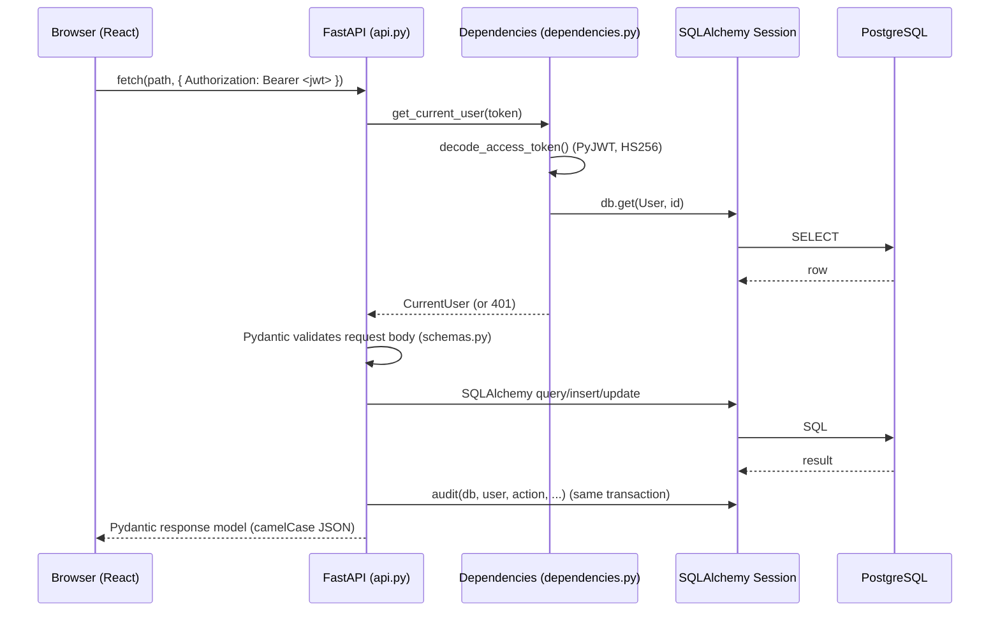

# System Architecture

> Note: this file is the current-implementation architecture doc for the Obsidian vault. A
> legacy pre-rewrite architecture doc also exists at the repo's `docs/` root — see
> [[architecture]] (lowercase, original filename) for historical comparison.

## High-level shape

Two independently deployable units, talking over a versioned JSON REST API:



- The frontend is a static Vite build (`frontend/`) served by any static host; it never talks
  to PostgreSQL directly.
- The backend (`backend/app/`) is the **only** process that touches the database or the
  uploads directory.
- All API routes live under a single prefix, `/api/v1` (`app/config.py: api_prefix`).

## Request lifecycle



Full detail: [[Backend/Architecture|Backend Architecture]].

## Layers

| Layer | Location | Responsibility |
|---|---|---|
| Presentation | `frontend/src/pages/*`, `frontend/src/components/*` | Screens and reusable UI atoms/molecules/organisms |
| Client data access | `frontend/src/lib/api.ts` | Single `fetch` wrapper: attaches JWT, maps errors |
| API surface | `backend/app/api.py` | All REST endpoints, request→response orchestration |
| Validation contracts | `backend/app/schemas.py` | Pydantic request/response models, camelCase aliasing |
| Authorization | `backend/app/dependencies.py` | `CurrentUser` / `AdminUser` FastAPI dependencies |
| Domain logic | `backend/app/services.py` | Small shared helpers (current salary lookup, audit writes) |
| Persistence | `backend/app/models.py`, `backend/app/database.py` | SQLAlchemy ORM models, engine/session |
| Migrations | `backend/alembic/versions/*` | Versioned schema changes |

See [[Folder Structure]] for the full file tree.

## Deployment

`vercel.json` at the repo root defines two services for a Vercel monorepo deployment:

```json
{
  "services": {
    "frontend": { "root": "frontend", "framework": "vite" },
    "backend": { "root": "backend", "framework": "fastapi", "entrypoint": "app.main:app" }
  },
  "rewrites": [
    { "source": "/api/(.*)", "destination": { "service": "backend" } },
    { "source": "/(.*)", "destination": { "service": "frontend" } }
  ]
}
```

- Requests to `/api/*` route to the FastAPI service; everything else routes to the static
  Vite build (`frontend/vercel.json` also SPA-rewrites all paths to `/` for client-side
  routing).
- There is no containerization, message queue, or caching layer — a single FastAPI process
  and a single PostgreSQL database.

## What is explicitly out of scope today

- No microservices — one FastAPI app handles every module (hiring, employees, projects,
  payroll, settings).
- No background job runner — `POST /payroll/generate` computes synchronously inside the
  request.
- No object storage integration — uploaded employee documents are written to local disk
  (`settings.upload_dir`, default `uploads/`). See [[Known Limitations]].
- No multi-tenancy — single company, no tenant column anywhere in [[Database/Schema|Schema]].

## Related

[[Tech Stack]] · [[Folder Structure]] · [[Backend/Architecture|Backend Architecture]] ·
[[Frontend/UI Architecture|Frontend UI Architecture]] · [[Database/Relationships|Database Relationships]]
